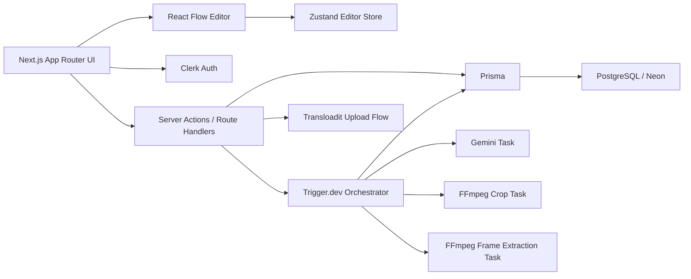

# NextFlow Design Doc

## Current Working Set: First 5 Steps

These are the first 5 implementation steps to execute before expanding scope:

1. Bootstrap the app foundation
   - Create Next.js app with App Router, TypeScript strict mode, Tailwind CSS, ShadCN UI, ESLint, Prettier, and folder conventions.
   - Set up environment validation, metadata, base layout, theme tokens, and production-safe defaults.
2. Build auth, data, and app shell
   - Integrate Clerk for sign-in/sign-up and protect workflow routes.
   - Add Prisma with PostgreSQL schema for users, workflows, workflow versions, run history, and node run details.
   - Create the main shell with left sidebar, canvas area, and right history panel.
3. Build the workflow canvas foundation
   - Add React Flow canvas with dot grid, zoom/pan, MiniMap, node drag/drop, selection, delete, undo/redo, and fit view.
   - Add Zustand store for graph state, UI state, and editor actions.
   - Enforce DAG validation and type-safe edge rules.
4. Implement the first usable nodes
   - Text Node
   - Upload Image Node
   - Upload Video Node
   - Node creation from sidebar click and drag
   - Configurable inputs with connected-input disabled state
5. Implement persistence and execution scaffolding
   - Autosave workflows
   - Load/save workflows from database
   - Create Trigger.dev task contracts for node execution
   - Define run orchestration model for single, selected, and full workflow execution
   - Seed the required sample workflow structure

## Session Summary

Use this section as the memory anchor between sessions. Update it after each meaningful work block.

### Session 0: Planning

- Read and synthesized the assignment screenshots, the Dub repository, and the Next.js production checklist.
- Confirmed the app is a Krea-inspired LLM workflow builder named `NextFlow`.
- Locked the 6 required node types:
  - Text
  - Upload Image
  - Upload Video
  - Run Any LLM
  - Crop Image
  - Extract Frame from Video
- Locked the must-have capabilities:
  - Clerk auth
  - Protected routes
  - React Flow canvas
  - Right sidebar workflow history
  - Node-level run history
  - DAG validation
  - Type-safe connections
  - Selective execution
  - Parallel execution
  - Workflow persistence
  - History persistence
  - Sample workflow
  - Vercel deployment readiness
- Chosen 5 bonus differentiators:
  - Retry from failed node
  - Autosave and draft recovery
  - Keyboard shortcuts and command palette
  - Workflow versioning and restore points
  - Execution debugger with per-node payload and timing inspection
- Important assumption:
  - The detailed functional spec is the implementation source of truth when it conflicts with the earlier standards page.

### Session 1: First 10 Steps Started

- Bootstrapped the Next.js App Router project and flattened it into the workspace root.
- Installed the core libraries:
  - Clerk
  - Prisma
  - React Flow
  - Zustand
  - Zod
  - Lucide React
  - UI utility helpers
- Added `.env.example` with the current required secret surface.
- Added Clerk route protection baseline using `src/proxy.ts`.
- Added environment helper scaffolding in `src/lib/env.ts`.
- Added Prisma schema models for workflows, versions, workflow runs, node runs, and editor snapshots.
- Added Prisma client wrapper scaffolding in `src/lib/db.ts`.
- Replaced the starter page with a project-specific landing page.
- Added a protected dashboard shell with:
  - top bar
  - left node sidebar
  - center canvas placeholder
  - right history panel
- Added sign-in and sign-up route scaffolding.
- Fixed Next.js root detection for this workspace in `next.config.ts`.
- Swapped remote Google fonts for local font stacks so the build is self-contained.
- Verified:
  - `npm run lint`
  - `npm run build`

### Session 2: Editor Foundation and First Interactive Nodes

- Replaced the placeholder canvas with a real React Flow editor.
- Added typed graph contracts in `src/types/editor.ts`.
- Added node factory and starter graph seeding in `src/lib/editor/node-factory.ts`.
- Added type-safe connection validation and cycle prevention in `src/lib/editor/connection-rules.ts`.
- Added Zustand editor state in `src/stores/editor-store.ts`.
- Added click-to-add and drag-to-canvas node creation from the left sidebar.
- Added the first interactive node UIs:
  - Text Node with editable textarea
  - Upload Image Node with local file preview
  - Upload Video Node with local video preview
- Added placeholder cards for the remaining required nodes so their handles and future execution shape are already visible:
  - Run Any LLM
  - Crop Image
  - Extract Frame
- Added seeded starter nodes and animated edges so the editor is immediately reviewable on load.
- Added fit view, zoom, pan, MiniMap, selection, and delete-key behavior through React Flow.
- Verified:
  - `npm run lint`
  - `npm run build`

### Session 3: Remaining Node UIs and Connected Input States

- Extended the node data model to support:
  - LLM model selection
  - system prompt text
  - user message text
  - inline result placeholder
  - crop parameter fields
  - frame timestamp field
- Added richer seeded sample graph behavior so the editor now resembles the required convergence workflow more closely:
  - branch A prompt generation
  - image crop branch
  - video frame extraction branch
  - final LLM convergence node
- Updated connection validation so `multiple` input ports can accept more than one incoming edge.
- Added reusable node-field UI wrappers for:
  - text inputs
  - textareas
  - connected-input state badges
- Built the `Run Any LLM` node UI with:
  - model selector
  - editable prompt fields
  - image-input status
  - inline result placeholder
- Built the `Crop Image` node UI with editable crop parameter fields.
- Built the `Extract Frame` node UI with editable timestamp input.
- Added connected-input disabled behavior so manual controls become read-only when an upstream edge is supplying that input.
- Verified:
  - `npm run lint`
  - `npm run build`

### Session 4: Local Execution Engine, Run Controls, and Live History

- Added execution types in `src/types/workflow.ts`.
- Added Zod-backed execution schemas in `src/lib/execution/schemas.ts`.
- Added graph execution helpers in `src/lib/editor/graph-utils.ts`.
- Added a first local execution simulator in `src/lib/execution/local-simulator.ts`.
- Upgraded the editor store to track:
  - active run
  - run history
  - node runtime state
  - full workflow execution
  - selected workflow execution
  - single-node execution via selected scope
- Added top bar run controls for:
  - run workflow
  - run selected
  - reset sample
- Added live node execution feedback:
  - running state
  - success state
  - failed state
  - node summary text
- Added live history panel entries fed from the current session instead of static placeholder data.
- Added inline LLM result updates from the simulated run engine.
- Important current status:
  - execution works locally in the UI
  - Trigger.dev is not wired yet
  - Gemini and FFmpeg are not wired yet
  - history is not persisted yet
- Verified:
  - `npm run lint`
  - `npm run build`

### Session 5: Persistence Layer, Autosave, Import/Export, and Run Debugger

- Added serializable workflow document contracts and hydration payload types so the editor can move cleanly between:
  - starter sample state
  - local draft recovery
  - database-backed workflow state
- Added browser persistence helpers for:
  - local draft backup
  - local run history backup
- Added server workflow persistence utilities and API routes for:
  - load current workflow
  - save current workflow
  - create workflow versions
  - persist workflow run history
- Updated the dashboard to hydrate editor state from the server when available.
- Extended the editor store to track:
  - workflow id
  - workflow name and description
  - save state
  - save message
  - last saved timestamp
  - workflow versions
  - pending save requests
- Added autosave with local fallback and draft recovery behavior.
- Upgraded the top bar so these controls now work:
  - save draft
  - save version
  - import workflow JSON
  - export workflow JSON
  - reset sample
- Upgraded the history panel into a run debugger with:
  - click-to-expand runs
  - node-level input summaries
  - node-level output summaries
  - node-level durations
  - dependency visibility
  - persisted-source badges
  - node-level error messages
- Persisted completed local runs with:
  - remote database persistence when available
  - local fallback when remote persistence is unavailable
- Important current status:
  - save/load/import/export are now wired
  - autosave and draft recovery are now wired
  - workflow version creation is wired
  - Trigger.dev, Gemini, and FFmpeg execution are still not wired
- Verified:
  - `npm run lint`
  - `npm run build`

### Session 6: Trigger.dev Orchestration, Gemini, FFmpeg Tasks, and Remote Run Dispatch

- Added the real execution scaffolding for Trigger.dev:
  - `trigger.config.ts`
  - Trigger build extensions for FFmpeg and Prisma
  - package scripts for local Trigger.dev development and deployment
- Extended environment configuration with:
  - `TRIGGER_PROJECT_REF`
  - Trigger/Gemini capability checks in `src/lib/env.ts`
- Upgraded upload nodes so media is stored as portable `data:` URLs instead of browser-only `blob:` URLs.
- Added shared Trigger task contracts and task payload types for:
  - text node execution
  - media node execution
  - LLM execution
  - crop image execution
  - extract frame execution
  - full workflow execution orchestration
- Added Trigger worker utilities for:
  - media resolution
  - FFmpeg execution
  - ffprobe duration lookup
  - temporary file lifecycle
  - Gemini model mapping
- Added child Trigger tasks:
  - `text-node-task`
  - `media-node-task`
  - `llm-node-task`
  - `crop-image-task`
  - `extract-frame-task`
- Added parent orchestration task:
  - `execute-workflow-task`
  - computes included nodes for single/selected/full runs
  - schedules DAG batches in parallel
  - waits on convergence nodes correctly
  - persists node-level run records back to PostgreSQL
  - updates final workflow-run status and duration
- Added remote execution API flow:
  - save workflow before dispatch
  - create queued workflow run
  - trigger remote orchestration task
  - attach Trigger run id
  - fail gracefully if dispatch cannot start
- Updated the editor store so run actions now:
  - prefer Trigger.dev execution when configured
  - fall back to the local simulator when remote execution is unavailable
- Added history polling so queued/running remote executions refresh automatically in the right sidebar.
- Tightened Trigger task typing end to end so the orchestrator and child tasks now compile cleanly with explicit payload contracts.
- Important current status:
  - remote execution path is implemented
  - Gemini and FFmpeg worker tasks are implemented
  - local execution fallback still exists for environments without Trigger or database setup
  - end-to-end real remote execution still depends on valid env keys and a connected Trigger.dev project
- Verified:
  - `npm run lint`
  - `npx tsc --noEmit`
  - `npm run build`

### Session 7: Editor Power-User UX, Sample Workflow Polish, and Run Visibility

- Added editor history stacks in the Zustand store so workflow graph changes now support:
  - undo
  - redo
  - bounded document history
- Added command state to the store for:
  - open command palette
  - close command palette
  - toggle command palette
- Added top-bar controls for:
  - undo
  - redo
  - command menu launch
- Added keyboard shortcuts for:
  - save draft
  - save version
  - undo
  - redo
  - open command palette
  - run full workflow
  - run selected workflow
- Added a searchable command palette with fast access to:
  - run workflow
  - run selected
  - save draft
  - save version
  - undo
  - redo
  - reset sample workflow
- Improved remote run lifecycle handling in the editor store so queued Trigger.dev runs now:
  - show up as the active run immediately
  - mark included nodes as queued
  - keep the right sidebar and runtime state in sync when history polling updates
- Upgraded the canvas overlay so the built-in starter graph is explicitly presented as the grading sample workflow.
- Confirmed the sample workflow now clearly demonstrates:
  - all 6 required node types
  - parallel branches
  - convergence behavior
- Improved the history panel with:
  - per-run status counters
  - clearer partial-success visibility
  - deduping between active run and persisted run history
- Added stronger visual execution feedback on nodes:
  - queued glow state
  - running glow state
  - clearer waiting/skipped styling
- Cleaned up visible text glitches from earlier encoding artifacts in editor UI labels.
- Important current status:
  - keyboard shortcuts are now implemented
  - command palette is now implemented
  - undo/redo is now implemented
  - sample workflow presentation is now implementation-complete
  - the next hard boundary is real end-to-end service validation with your env keys
- Next exact 5 steps once env is added:
  1. Run Prisma against the target database and verify workflow persistence with your real account.
  2. Run `trigger:dev` and validate Gemini, crop, and frame tasks end to end.
  3. Verify queued/running/completed history states against real Trigger.dev executions.
  4. Add retry-from-failed-node.
  5. Add restore-point recovery for saved workflow versions.
- Verified:
  - `npx tsc --noEmit`
  - `npm run lint`
  - `npm run build`

### Session 8: Dev Runtime Stability Fix

- Investigated the `npm run dev` failure path.
- Confirmed there were two separate issues:
  - a duplicate local Next.js dev server was already running for the same project
  - the browser-side editor had an infinite render loop in `WorkflowNodeCardComponent`
- Root cause of the runtime loop:
  - a Zustand selector in the node card returned a newly created array on every render
  - React flagged this as `getSnapshot should be cached`
  - the page eventually hit `Maximum update depth exceeded`
- Fixed the node card to use stable store functions instead of building a fresh derived array inside the selector.
- Verified:
  - `npx tsc --noEmit`
  - `npm run lint`

### Session 9: Retry and Restore Recovery

- Added restore-point document persistence for saved workflow versions in local browser storage.
- Added a new version document API endpoint so saved versions can be restored from database-backed history when available.
- Added client-side version document fetching and parsing so restore flows remain type-safe.
- Extended the editor store with:
  - `restoreWorkflowVersion(versionId, versionLabel)`
  - `retryLatestFailedRun()`
  - shared execution-target resolution for full, selected, and retry-driven reruns
- Added top-bar actions for:
  - restoring the latest saved version
  - retrying the latest failed run
- Extended the command palette with:
  - restore latest version
  - restore the most recent restore points
  - retry latest failed run
- Improved manual version saves so remote version snapshots are cached locally for later restore.
- Added local fallback behavior:
  - local version snapshots still work even when remote persistence is unavailable
  - restore can fall back to local cached version documents first
- Important current status:
  - retry-from-failed-node is now implemented
  - restore-point recovery is now implemented through local snapshot caching plus restore actions
  - no new env keys were required for this slice
- Next exact 5 steps once env is added:
  1. Validate remote database version history with real saved versions under your account.
  2. Run `trigger:dev` and verify Gemini, crop, and frame tasks end to end.
  3. Verify failed remote runs can be retried cleanly from persisted history.
  4. Polish the history and version UI for clearer restore affordances.
  5. Finish deployment readiness and demo flow validation.
- Verified:
  - `npx tsc --noEmit`
  - `npm run lint`
  - `npm run build`

### Session 10: Environment Honesty and Service Diagnostics

- Added the provided Clerk, Gemini, and Trigger.dev keys to the root `.env` file so the live app now reads the correct project-level env file.
- Confirmed the only remaining service blocker is `DATABASE_URL`, which is still using the Prisma starter placeholder rather than a real PostgreSQL connection string.
- Tightened environment checks so:
  - Trigger.dev is only treated as configured when both `TRIGGER_SECRET_KEY` and `TRIGGER_PROJECT_REF` are present
  - the starter placeholder Postgres URL is no longer treated as a valid database configuration
- Added a typed environment status object so the dashboard can surface configuration readiness instead of failing silently.
- Updated the top bar to show service readiness and the first unresolved configuration issue directly in the UI.
- Improved server API error messages so failed saves and remote execution attempts now point to the actual missing requirement.
- Important current status:
  - Clerk, Gemini, Trigger secret, and Trigger project ref are now wired into the root app env
  - the project still needs a real PostgreSQL URL before remote persistence and Trigger-backed execution can be verified end to end
  - this slice did not require any further code changes from you beyond the env file update
- Next exact 5 steps once a real Postgres URL is added:
  1. Verify dashboard hydration and draft/version persistence against the live database.
  2. Run Trigger.dev locally and confirm queued remote runs are created successfully.
  3. Validate Gemini and FFmpeg task execution through Trigger.dev.
  4. Verify persisted failed runs can be retried cleanly.
  5. Finish deployment readiness and demo walkthrough support.
- Verified:
  - `npx tsc --noEmit`
  - `npm run lint`
  - `npm run build`

### Session 11: Health Endpoint and Setup Readiness

- Performed live health checks against the configured services:
  - Clerk secret key: valid
  - Clerk publishable key frontend host: reachable
  - Gemini API key: valid
  - Trigger.dev secret key plus project ref: valid
  - Database: still not ready because `DATABASE_URL` points to the starter placeholder
- Added a typed health-report model and a reusable health helper.
- Added a new health endpoint:
  - `/api/health`
  - returns environment readiness plus database connectivity status
- Passed environment readiness deeper into the editor shell and workspace.
- Added a setup checklist card to the history panel so the dashboard now shows:
  - Clerk status
  - PostgreSQL status
  - Trigger.dev status
  - Gemini status
  - the first unresolved setup issue
- Added repo docs for:
  - environment setup
  - Vercel deployment
  - demo video checklist
- Important current status:
  - all API keys except the database connection are healthy
  - the remaining blocker is still a real PostgreSQL connection string
  - deployment and demo prep docs now exist inside the repo
- Next exact 5 steps once a real Postgres URL is added:
  1. Run Prisma against the real database and confirm table creation.
  2. Validate remote workflow save/load against authenticated user scope.
  3. Run Trigger.dev tasks end to end with Gemini and FFmpeg.
  4. Verify persisted remote run history and failed-run retry.
  5. Finish the visual polish pass and final deployment checks.
- Verified:
  - `npx tsc --noEmit`
  - `npm run lint`
  - `npm run build`

### Session 12: Neon Database Connected

- Replaced the placeholder `DATABASE_URL` with the real Neon PostgreSQL connection string in the root env file.
- Verified live connectivity to the Neon database with a direct `select current_database(), now()` check.
- Confirmed the active database is `neondb`.
- Ran `npx prisma db push` successfully against Neon.
- The Prisma schema is now synced to the remote database and the required tables exist.
- Important current status:
  - Clerk is healthy
  - Gemini is healthy
  - Trigger.dev is healthy
  - PostgreSQL is now healthy
  - the next step is validating authenticated persistence and Trigger-backed execution through the running app
- Next exact 5 steps:
  1. Start `npm run dev` if it is not already running.
  2. Start `npm run trigger:dev` in a second terminal.
  3. Verify `/api/health` reports a ready database.
  4. Save a workflow and confirm it persists remotely for the signed-in user.
  5. Run the sample workflow and confirm Trigger-backed history updates.
- Verified:
  - Neon connection check succeeded
  - `npx prisma db push`

### Session 13: URL-Backed Media Fix for Large Videos

- Investigated the failing end-to-end workflow runs and isolated the root cause:
  - large video files were being embedded into Trigger.dev task input as base64 data URLs
  - this caused `TASK_INPUT_ERROR` on large video payloads
- Proved the issue was payload-size related, not logic related:
  - image upload task: success
  - crop image task: success
  - Gemini LLM task: success
  - large inline video payload: failure
  - tiny inline video payload: success
- Implemented a real fix:
  - added a `MediaAsset` Prisma model
  - added media upload and media fetch API routes
  - added media client/server helpers
  - updated node data to store `mediaUrl` and `mediaAssetId`
  - updated the editor upload nodes to persist media to a fetchable asset URL instead of relying on huge inline payloads
  - updated Trigger.dev media handling to pass around a generic media reference, not only `data:` URLs
- Validated the fix with a full end-to-end automation smoke test using:
  - a real local image from the device
  - a real large local video from the device
  - URL-backed media references
  - the full sample workflow
- Result of the full smoke test:
  - Trigger parent workflow: success
  - persisted workflow run: success
  - node runs: success for all 9 nodes
  - FFmpeg crop: success
  - FFmpeg frame extraction: success
  - Gemini branch copy generation: success
  - Gemini convergence summary generation: success
- Important current status:
  - the core automation stack now works end to end when media is stored behind URLs
  - the remaining practical step for the browser experience is to restart the running `npm run dev` process so the new Prisma client and media routes are picked up cleanly by the local dev server
- Next exact 5 steps:
  1. Restart `npm run dev`.
  2. Sign in and upload a real image and video through the dashboard.
  3. Save the workflow and confirm uploaded assets persist as URLs.
  4. Run the full workflow from the browser UI and inspect the history panel.
  5. Finish the last visual polish and deployment pass.
- Verified:
  - `npx prisma db push`
  - `npx prisma generate`
  - `npx tsc --noEmit -p tsconfig.sourcecheck.json`
  - `npx eslint` on all changed TS files
  - full end-to-end Trigger.dev smoke test with URL-backed media

## 1. Project Goal

Build `NextFlow`, a production-style visual workflow builder for LLM-centric content pipelines. The app should feel like a polished product, not a classroom prototype: fast, intentional, resilient, and demo-ready.

The app must replicate the core interaction patterns of Krea's workflow builder while remaining maintainable, type-safe, and deployable.

## 2. Product Principles

- Pixel-accurate where grading depends on visual fidelity.
- Product-grade where reviewers will judge reliability, clarity, and polish.
- Fast to demo: common actions should take very few clicks.
- Strictly typed and schema-validated end to end.
- Execution-first architecture: workflows, node runs, and history are first-class entities.
- Build for extension: future node types should slot into the system without rewriting the editor.

## 3. Scope

### 3.1 Required Scope

- Krea-style editor layout
- Left sidebar with exactly 6 quick-access node buttons
- Right sidebar with workflow run history
- React Flow canvas with grid, zoom, pan, MiniMap
- Responsive design
- Clerk authentication
- Protected workflow routes
- Workflow persistence
- Workflow history persistence
- 6 functional node types
- Gemini integration through Trigger.dev
- FFmpeg-based media processing through Trigger.dev
- Type-safe node connections
- DAG validation
- Single node execution
- Selected nodes execution
- Full workflow execution
- Parallel execution for independent branches
- Inline LLM result display on the LLM node
- Sample workflow demonstrating all requirements
- Import/export as JSON
- Deployment-ready configuration

### 3.2 Bonus Scope: Only 5 Extra Features

These are the only bonus features to pursue unless the required set is already complete and stable.

1. Retry from failed node
2. Autosave plus draft recovery
3. Keyboard shortcuts plus command palette
4. Workflow versioning plus restore points
5. Execution debugger with per-node payloads, timings, and dependency wait states

## 4. Source-of-Truth Decision

There is a stack conflict between the earlier standards page and the later detailed assignment pages.

### 4.1 Conflicting Requirements

- Earlier page mentions:
  - MongoDB
  - Cloudinary
  - Uploadcare
- Later detailed assignment mentions:
  - PostgreSQL
  - Prisma
  - Neon
  - Transloadit

### 4.2 Chosen Interpretation

The later detailed assignment is the implementation source of truth because it defines:

- exact node behavior
- run history behavior
- database persistence expectations
- sample workflow grading path
- Trigger.dev execution model

### 4.3 Practical Build Decision

Primary stack for this project:

- PostgreSQL + Prisma for persistence
- Transloadit for upload and media pipelines
- Trigger.dev for all runtime execution

The earlier page will still guide:

- code quality expectations
- documentation expectations
- responsiveness
- product polish

## 5. User Flows

### 5.1 Primary User Flow

1. User signs in with Clerk.
2. User enters the editor dashboard.
3. User creates a new workflow or opens an existing one.
4. User drags nodes from the sidebar onto the canvas.
5. User configures node inputs manually or by connecting outputs.
6. User runs a single node, selected subgraph, or full workflow.
7. User sees running states on active nodes.
8. User reviews inline outputs and the right-side run history.
9. User clicks a run entry to inspect node-level execution details.
10. User saves, autosaves, versions, exports, or reopens the workflow later.

### 5.2 Demo Flow

1. Sign in
2. Open sample workflow
3. Upload image and video
4. Run full workflow
5. Show parallel branch behavior
6. Show node-level pulsing glow during execution
7. Open history sidebar
8. Inspect node-level results and timings
9. Run selected nodes
10. Export workflow JSON

## 6. Architecture Overview



## 7. Proposed Tech Stack

- Next.js 15+ with App Router
- TypeScript strict mode
- Tailwind CSS
- ShadCN UI
- React Flow
- Zustand
- Zod
- Clerk
- Prisma
- PostgreSQL on Neon
- Trigger.dev
- Gemini API via Google AI SDK
- Transloadit
- Lucide React
- Vercel

## 8. Folder Strategy

```text
src/
  app/
    (marketing)/
    (auth)/
    dashboard/
    api/
  components/
    editor/
    nodes/
    history/
    ui/
  lib/
    auth/
    db/
    editor/
    execution/
    validation/
    uploads/
    ai/
  server/
    actions/
    queries/
  stores/
  types/
  trigger/
    tasks/
    orchestration/
prisma/
docs/
```

## 9. Core Domain Model

### 9.1 Entities

- User
- Workflow
- WorkflowVersion
- WorkflowRun
- NodeRun
- EditorSnapshot

### 9.2 Suggested Prisma Models

- `User`
- `Workflow`
  - id
  - userId
  - name
  - description
  - graphJson
  - latestVersionId
  - createdAt
  - updatedAt
- `WorkflowVersion`
  - id
  - workflowId
  - versionNumber
  - graphJson
  - createdAt
  - createdBy
- `WorkflowRun`
  - id
  - workflowId
  - userId
  - status
  - scopeType
  - selectedNodeIds
  - startedAt
  - completedAt
  - durationMs
  - triggerRunId
- `NodeRun`
  - id
  - workflowRunId
  - nodeId
  - nodeType
  - status
  - startedAt
  - completedAt
  - durationMs
  - inputSnapshotJson
  - outputSnapshotJson
  - errorMessage
- `EditorSnapshot`
  - id
  - workflowId
  - source
  - snapshotJson
  - createdAt

## 10. Node System Design

### 10.1 Required Node Types

#### Text Node

- Purpose: static text input
- Input handles: none
- Output handles:
  - `text`
- UI:
  - textarea
  - output preview

#### Upload Image Node

- Purpose: upload image and emit image URL
- Accepts:
  - jpg
  - jpeg
  - png
  - webp
  - gif
- Output handles:
  - `image_url`
- UI:
  - upload button
  - preview thumbnail
  - upload status

#### Upload Video Node

- Purpose: upload video and emit video URL
- Accepts:
  - mp4
  - mov
  - webm
  - m4v
- Output handles:
  - `video_url`
- UI:
  - upload button
  - player preview
  - upload status

#### Run Any LLM Node

- Purpose: run Gemini prompt with multimodal support
- Input handles:
  - `system_prompt`
  - `user_message`
  - `images`
- Output handles:
  - `output`
- UI:
  - model selector
  - text inputs
  - image connection state
  - run button
  - inline response view

#### Crop Image Node

- Purpose: crop image with FFmpeg via Trigger.dev
- Input handles:
  - `image_url`
  - `x_percent`
  - `y_percent`
  - `width_percent`
  - `height_percent`
- Output handles:
  - `output`
- UI:
  - numeric controls
  - connected-input disable state
  - result preview

#### Extract Frame from Video Node

- Purpose: extract one frame with FFmpeg via Trigger.dev
- Input handles:
  - `video_url`
  - `timestamp`
- Output handles:
  - `output`
- UI:
  - timestamp input
  - result preview

### 10.2 Node Registry Pattern

Create a registry that centralizes:

- node metadata
- default data shape
- input/output definitions
- validators
- renderer component
- execution adapter
- serialization rules

This prevents node logic from being scattered across the codebase.

## 11. Graph Rules

- Graph must remain a DAG.
- Invalid connections are blocked visually and functionally.
- Output/input compatibility is type-based.
- Connected inputs override manual form entry.
- Selected-node execution must only run the valid upstream dependency subgraph.
- Full workflow execution should topologically sort nodes and then schedule runnable nodes in batches.

## 12. Execution Engine

### 12.1 Execution Types

- Full workflow run
- Selected nodes run
- Single node run
- Retry failed node run

### 12.2 Execution Algorithm

1. Validate graph and selected execution scope.
2. Build dependency graph.
3. Resolve upstream requirements.
4. Topologically group nodes by readiness.
5. Launch independent nodes in parallel through Trigger.dev.
6. Persist node run state transitions.
7. Stop or continue based on dependency failures and scope rules.
8. Persist final workflow run summary.

### 12.3 Convergence Handling

A node with multiple upstream dependencies must wait until all required parents succeed.

### 12.4 Failure Handling

- Mark failed node clearly
- Preserve successful sibling branch outputs
- Show partial run visibility in history
- Persist error messages
- Allow retry from failed node for bonus scope

## 13. History and Debugging

### 13.1 Required History

- Run list in right sidebar
- Entry fields:
  - timestamp
  - status
  - duration
  - scope
- Expanded run view:
  - node-by-node statuses
  - inputs used
  - outputs generated
  - execution time
  - errors

### 13.2 Bonus Debugger

- dependency wait state
- trigger task id
- payload summary
- raw result summary
- retry action

## 14. UI Architecture

### 14.1 Screen Areas

- Top bar
  - workflow title
  - save state
  - run controls
  - import/export
  - command palette trigger
- Left sidebar
  - search
  - exactly 6 node buttons
  - drag and click add
- Center canvas
  - dot grid
  - nodes and animated edges
  - contextual controls
- Right sidebar
  - history list
  - run details

### 14.2 Visual Goals

- Crisp, quiet, product-style interface
- Strong spacing rhythm
- Smooth panning and zooming
- Subtle but visible active run animation
- Clean loading and empty states
- Professional typography and status colors

## 15. State Management

Use Zustand slices instead of one oversized store.

Suggested slices:

- `graphStore`
- `selectionStore`
- `historyStore`
- `uiStore`
- `autosaveStore`

Keep server state outside Zustand where possible.

## 16. API and Validation Strategy

- Zod schema for every node config
- Zod schema for serialized workflow graph
- Zod schema for execution payload
- Shared server/client type definitions where possible
- Reject malformed imported JSON gracefully

## 17. Security and Production Readiness

- Protect dashboard routes with Clerk middleware
- Scope every workflow query by authenticated user
- Never trust client-provided workflow ownership
- Validate uploads and accepted MIME types
- Store secrets in env only
- Add metadata, error pages, and empty states
- Test `next build` regularly
- Keep bundle size under control
- Use server actions or route handlers carefully with explicit validation

## 18. Performance Strategy

- Lazy-load heavy editor modules if needed
- Split dashboard/editor shell from marketing/auth pages
- Debounce autosave
- Minimize React Flow rerenders
- Store large run payloads efficiently
- Avoid unnecessary refetches on history updates

## 19. Testing Strategy

### 19.1 Must-Test Paths

- auth protection
- workflow save/load
- import/export
- DAG validation
- invalid edge blocking
- single/selected/full execution
- parallel execution
- convergence node waiting behavior
- history persistence
- LLM inline result rendering
- upload success and failure flows

### 19.2 Testing Levels

- Unit tests for graph utilities and validators
- Integration tests for API routes and execution orchestration
- Manual end-to-end checklist for demo-critical flows

## 20. Delivery Strategy

### Phase A: Foundation

- project bootstrap
- auth
- schema
- layout shell

### Phase B: Editor Core

- React Flow integration
- left/right sidebars
- canvas interactions
- type-safe edges

### Phase C: Node System

- all 6 nodes
- registry
- form UX
- previews

### Phase D: Execution

- Trigger.dev orchestration
- Gemini task
- FFmpeg tasks
- parallel scheduling

### Phase E: History and Persistence

- workflow save/load
- run history
- node-level details
- import/export

### Phase F: Polish and Bonus Features

- autosave recovery
- retry failed node
- command palette
- versions
- debugger

## 21. 120-Hour Time Budget

- 10h: planning, visual study, architecture, repo setup
- 15h: auth, schema, protected routes, app shell
- 20h: React Flow editor core
- 20h: node implementations and upload flows
- 20h: Trigger.dev orchestration and run engine
- 10h: history panel and node-level execution details
- 10h: autosave, import/export, sample workflow
- 10h: bonus features
- 5h: deployment, testing, demo prep

## 22. Definition of Done

The project is done when:

- every item on the deliverables checklist is satisfied
- the sample workflow runs end to end
- required demo actions are smooth and repeatable
- the UI looks intentional and polished
- data is scoped correctly by user
- errors are visible and recoverable
- deployment is live and stable

## 23. Open Risks

- Krea visual fidelity may take longer than expected if left too late.
- Trigger.dev orchestration can become the critical path if not scaffolded early.
- Upload provider complexity can eat time if the integration surface is overbuilt.
- History data shape can get messy if node payload schemas are not normalized.
- Bonus features should not begin until the required checklist is stable.

## 24. Immediate Next Actions

From here, the next implementation slice should follow this order:

1. Validate real Prisma persistence and version history against your configured database.
2. Run Trigger.dev locally and verify Gemini, crop, and frame tasks end to end.
3. Test remote failed runs and confirm retry behavior matches persisted history.
4. Polish the restore/version UX so saved snapshots are easier to browse.
5. Finish deployment readiness, env documentation, and demo walkthrough support.

## Session 14 Summary

Completed a polish-and-delivery pass after the URL-backed media execution fix. The editor shell, top bar, canvas overlay, node sidebar, and history panel were adjusted to behave more cleanly across narrower screens and mixed viewport heights. The client workflow API helper was also tightened so failed requests now surface JSON `message` or `error` payloads correctly instead of falling back to vague generic errors.

Added the missing root delivery files so the repo is easier to run and ship: a root `README.md` with setup and command guidance, plus `vercel.json` for straightforward Next.js deployment. This session keeps the working execution path intact while making the project easier to verify locally and hand off for deployment.

### Decisions made

- Keep the working Trigger.dev execution path untouched and focus this slice on polish, ergonomics, and delivery readiness.
- Prefer responsive layout adjustments in existing components over introducing a new layout abstraction late in the project.
- Keep deployment readiness lightweight: environment docs, Vercel config, and root quickstart are sufficient for this stage.

### Open risks

- The live browser flow still needs a clean restart of `npm run dev` and `npm run trigger:dev` so the new media route and latest Prisma client are guaranteed to be active in the running processes.
- A final browser-side sign-in, upload, run, and history verification pass is still needed before calling the assignment fully finished.
- The visual polish is stronger now, but a final pixel-accuracy pass against Krea references may still uncover spacing tweaks.

### Next exact steps

1. Restart the local Next.js and Trigger.dev processes.
2. Run one signed-in dashboard flow with a real image and a real video.
3. Confirm upload previews, persisted asset storage, and full workflow completion from the browser.
4. Fix any last browser-only edge cases found during that run.
5. Move into final deployment and demo recording prep.

## Session 15 Summary

Completed a behavior-focused pass on the remaining workflow execution gaps. The editor now exposes an explicit single-node run path in addition to the existing full-workflow and selected-group runs, and the validation around each action is clearer. `Run selected` now expects two or more selected nodes, while `Run node` handles the one-node case cleanly and uses the same upstream-dependency planning used by the execution engine.

This session also tightened user-scoped API behavior and runtime updates. Workflow save/history/version/execution and media-upload routes now return auth-aware `401` responses when Clerk is configured but the user is not signed in, instead of misleading generic infrastructure errors. The editor store was updated so polled remote runs correctly repaint node runtime state when they finish, which keeps queued/running nodes from feeling stale after the backend completes.

### Decisions made

- Separate single-node execution from selected-group execution in the UI so the grading criteria are visible, not implicit.
- Prefer route-level auth guards instead of broad server refactors late in the build.
- Treat completed remote runs as the source of truth for runtime status once polling replaces the local queued state.

### Open risks

- The remaining major unknown is still the final browser-side signed-in run after a clean local restart.
- Pixel-accuracy against Krea can still improve, but the functional grading surface is in much better shape now.
- Performance cleanup is still open for very large canvases or long histories.

### Next exact steps

1. Restart `npm run dev` and `npm run trigger:dev`.
2. Sign in and run one single-node execution, one selected-group execution, and one full workflow execution.
3. Confirm history, node runtime repainting, and restore/retry actions in the browser.
4. Address any final browser-only edge cases from that pass.
5. Move into final deployment and demo recording polish.

## Session 16 Summary

Added a final-verification layer to make the last stretch easier to trust. The health report is now deeper: it includes the current Clerk request session state plus runtime checks for `ffmpeg` and `ffprobe`, and it returns concrete next manual checks instead of only raw config flags. This makes `/api/health` much more useful during the final demo and deployment pass.

I also added a one-command local verifier in `npm run verify:local` plus a dedicated [docs/final-verification.md](C:\Users\kumar\Downloads\XOXO\Assignment\docs\final-verification.md) guide. Together, those changes reduce the amount of manual remembering needed tomorrow: the repo now tells you what is healthy, what still needs a browser session, and what exact run sequence to test before submission.

### Decisions made

- Treat final verification as a product feature for the repo, not just an internal memory exercise.
- Keep the verifier lightweight and dependency-free by using Node's built-in `fetch`.
- Add runtime binary checks because FFmpeg availability is critical to the assignment and easy to overlook.

### Open risks

- The local verifier cannot prove signed-in dashboard actions by itself; a real browser session is still required for the final pass.
- `/api/health` now does more work per request, so it should remain a verification endpoint rather than something polled aggressively.
- Final pixel polish and Vercel deployment are still the main remaining finish-line tasks.

### Next exact steps

1. Restart the local stack.
2. Run `npm run verify:local`.
3. Perform the signed-in dashboard flow from `docs/final-verification.md`.
4. Fix any remaining browser-only issues that surface during that pass.
5. Finish deployment and recording polish.

## Session 17 Summary

Completed a focused workflow-editor UX pass to make the dashboard feel less like a raw grading surface and more like a usable product. The node library is now easier to scan and search, the sample-workflow guide can stay collapsed by default so it no longer blocks the canvas, the top bar is grouped into clearer action clusters, and the right rail now separates day-to-day run inspection from environment setup.

This pass intentionally borrowed more from workflow tools such as n8n in terms of usability patterns rather than trying to force a strict Krea-style full-screen overlay everywhere. The result is a calmer editing surface: the main workflow stays in view, runs are easier to inspect, and setup information is still available without dominating the default dashboard state.

### Decisions made

- Keep the sample-workflow guide collapsed by default so the canvas remains the primary surface.
- Split the right panel into `Runs` and `Setup` tabs so operational status does not crowd out execution history.
- Group top-bar actions by intent: edit, save/version, recovery, and run controls.

### Open risks

- A final in-browser pass is still needed to confirm the new layout feels good across the user’s actual screen sizes.
- Visual polish is stronger now, but there is still room for a last spacing and typography pass before submission.
- The project is closer to an n8n-like editor experience now, but final responsiveness and deployment polish are still not fully signed off.

### Next exact steps

1. Refresh the signed-in dashboard and confirm the guide starts collapsed.
2. Run one node, one selected group, and one full workflow from the new grouped top bar.
3. Confirm the right panel tabs feel clear and that run details still expand correctly.
4. Make any final spacing tweaks found during that browser pass.
5. Finish Vercel deployment and demo-recording prep.

## Session 18 Summary

Reshaped the dashboard into a more editor-first workspace. The layout now follows a clearer studio pattern: a slim `Workspace Rail`, a dedicated `Node Library`, a dominant `Workflow Canvas`, and a `Run Inspector` on the right. The top bar was also framed more explicitly as the `Command Bar`, so the product reads less like a generic dashboard and more like a workflow IDE.

This change was aimed at usability rather than feature count. The canvas now has a stronger sense of ownership over the screen, while the surrounding panels feel like tools that support it instead of competing with it. That is a better fit for NextFlow, especially for users who will spend most of their time building and debugging workflows.

### Decisions made

- Adopt product-specific layout names instead of generic dashboard language.
- Keep the center canvas dominant and treat surrounding panels as rails and inspectors.
- Move the visual direction a bit closer to n8n and editor-style products without cloning VS Code terminology directly.

### Open risks

- A final browser pass is still needed to decide whether panel widths feel right on the user’s exact screen.
- The new workspace rail is currently structural and visual; we may still want stronger interactions there later.
- There is still room for a last visual-polish pass on spacing and typography before submission.

### Next exact steps

1. Refresh the dashboard and confirm the new shell feels more editor-like.
2. Verify the `Workspace Rail`, `Node Library`, `Workflow Canvas`, and `Run Inspector` proportions on desktop.
3. Run a full workflow and confirm the inspector still behaves correctly.
4. Make any final spacing or copy tweaks from that pass.
5. Finish deployment and demo prep.

## Session 19 Summary

Simplified the editor shell again after a real visual review. The earlier structure shift was correct, but it still carried too much dashboard-style information on screen at once. This pass removed the extra workspace strip, stripped the top chrome down into an `Automation Bar`, simplified the `Run Inspector`, tightened the `Workspace Rail`, and removed the large onboarding card from the center so the automation canvas can dominate the page.

The result is much closer to the intended product behavior: the screen is now centered around building and running automations rather than showing setup, summaries, and helper panels by default. The automation itself stays visible, and the surrounding UI reads more like a focused editor than a multi-card dashboard.

### Decisions made

- Remove non-essential status surfaces from the main view and keep only a lightweight live-stack indicator.
- Replace the large sample-workflow card with a minimal canvas label so the center stays visually open.
- Simplify the right side into a true `Run Inspector` instead of a mixed inspector-plus-dashboard panel.

### Open risks

- The top bar is now much cleaner, but button density may still need one final spacing pass after a live browser check.
- The current rail is primarily structural and visual, not a fully interactive mode switcher.
- A final browser refresh or local dev restart may still be needed if the previous shell is cached in the running process.

### Next exact steps

1. Refresh the dashboard and confirm the larger sample card is gone.
2. Check that the canvas now owns most of the screen width visually.
3. Verify one automation run from the new top bar.
4. Make one last spacing pass if any panel still feels too heavy.
5. Finish deployment and demo prep.

## Session 20 Summary

Added the interaction layer the editor was still missing. The `Workspace Rail` now behaves more like a real editor rail: hovering reveals labels, `Library` toggles the left panel, `Runs` toggles the right panel, and `Studio` switches into a canvas-focused mode by hiding both side panels. That makes the shell feel much closer to a tool such as VS Code or n8n instead of a fixed dashboard layout.

The nodes were also redesigned to be much less visually heavy. They now start in a compact, icon-first state so the canvas is easier to scan. When a node is selected, the user gets the two direct actions they asked for: `Open` and `Delete`. Opening a node expands it into the full detailed editor, while deleting no longer depends on keyboard shortcuts alone.

### Decisions made

- Keep the rail behavior simple and predictable: each icon toggles a concrete panel or focus mode.
- Make nodes compact by default and reserve the full card layout for intentional editing.
- Treat `Open` and `Delete` as first-class node actions surfaced on selection.

### Open risks

- The new compact node layout is much cleaner, but a final visual pass may still improve spacing between compact nodes and edge labels.
- Mobile behavior for the new panel toggles is less important than desktop right now and may still need refinement later.
- Some users may want persistent default-expanded nodes for certain workflows, which we can decide later after more testing.

### Next exact steps

1. Refresh the dashboard and confirm nodes start compact.
2. Click a compact node and verify `Open` and `Delete` appear when selected.
3. Toggle `Library`, `Runs`, and `Studio` from the rail to confirm the panel behavior feels right.
4. Run one workflow and make sure the compact node design still works during execution.
5. Finish the last visual-polish pass and deployment prep.

## Session 21 Summary

Refined the node interaction model again to match the intended behavior more closely. Nodes no longer default to a compact rectangle. They now rest as circles, reveal a lightweight preview card on hover, and expand into the full editor only when clicked. The floating action above selected nodes was also simplified so it now shows `Delete` only.

This keeps the canvas much cleaner while still preserving discoverability. Hover gives a quick read of what the node is, click pins the detailed editor open, and clicking the node icon in the expanded card collapses it back to the circular state.

### Decisions made

- Make the circular state the true default node shape.
- Use hover for preview and click for persistent expansion.
- Remove `Open` from the selection popup and keep only `Delete`.

### Open risks

- The circular default is cleaner, but some users may still want more visible labels on the canvas later.
- Connection handle placement on compact circles is denser now and may need one final spacing pass after browser testing.
- The side-panel compression work is still only partially addressed compared with the node interaction model.

### Next exact steps

1. Refresh the dashboard and confirm nodes render as circles first.
2. Hover a node and confirm the preview card appears.
3. Click a node circle and confirm it stays open until you click the icon again.
4. Confirm only `Delete` appears in the floating node action.
5. Continue the side-panel compression pass if needed.

## Session 22 Summary

Finished the side-panel compression pass that was still lagging behind the node redesign. The `Workspace Rail` is now truly icon-first, with hover tooltips carrying the labels and mode context instead of leaving large pill buttons on screen. The `Automation Library` and `Run Inspector` were both narrowed and rewritten to behave more like compact editor panels instead of dashboard sections.

The left panel now uses a denser block list, a shorter header, and a lighter search area so it stops dominating the canvas. The right panel now opens into a compact run list with a much smaller empty state instead of a tall mostly-empty card. I also removed the duplicate mode chips from the top bar so the rail becomes the primary place for opening and closing panels.

### Decisions made

- Keep the side navigation icon-first and put labels into hover tooltips instead of permanent text.
- Reduce left and right panel widths so the canvas owns more of the screen by default.
- Remove duplicate chrome from the top bar when the rail already provides the same navigation affordance.

### Open risks

- The shell is now much tighter, but the library cards themselves may still want one more density pass after live browser use.
- The right inspector is smaller and cleaner, but a future run-heavy workflow may still benefit from filter controls later.
- Final browser validation is still needed to confirm the tighter shell feels good during real uploads and run inspection.

### Next exact steps

1. Refresh the dashboard and verify the rail is icon-only with hover tooltips.
2. Toggle the `Library` and `Runs` icons and confirm the side panels open and close cleanly.
3. Check that the narrower panels give the canvas noticeably more room.
4. Run one workflow and confirm the smaller `Run Inspector` still reads clearly.
5. Continue the final visual-polish pass only if another live pain point appears.

## Session 23 Summary

Closed the final code-side cleanup pass. The main improvement here was treating node expansion as UI state instead of a meaningful workflow edit: opening and closing a node no longer dirties the workflow, clutters undo history, or churns autosave unnecessarily. I also stopped persisting expanded-node state into workflow documents, which keeps exports and saved versions cleaner and more stable.

I paired that with a last responsive/polish pass on the canvas overlay so the extra badge gets out of the way on smaller screens. After the code cleanup, I re-ran typecheck, lint, production build, and the local verifier. Everything passed except the expected browser-session check from the terminal, which is now documented more clearly so it does not look like a stack failure.

### Decisions made

- Treat node open/close as UI-only behavior rather than a workflow mutation.
- Strip `isExpanded` from persisted workflow documents and reset it during hydration.
- Mark performance cleanup and the main visual-polish pass as complete, while keeping true browser signoff and Vercel deploy as the remaining manual steps.

### Open risks

- Pixel-perfect matching to Krea is still an approximation rather than a literal clone, so I am leaving that roadmap item as in progress.
- Final browser demo validation still depends on one signed-in manual pass.
- Final Vercel deployment still requires your Vercel account and production URL.

### Next exact steps

1. Run one final signed-in browser pass on `/dashboard`.
2. Record the demo following `docs/demo-video-checklist.md`.
3. Import the repo into Vercel and add the production env vars.
4. Deploy the app and update `NEXT_PUBLIC_APP_URL` to the deployed URL.
5. Recheck `/api/health` and one production workflow run.

## Session 24 Summary

Implemented the missing Transloadit alignment so the project matches the assignment stack more closely. Media uploads now support a real Transloadit-first server path: the upload route sends the file to Transloadit, waits for the assembly to complete, downloads the uploaded result immediately, and persists that file into the app's own media storage. This keeps the grading story honest while preserving the stable persisted URLs that the rest of the workflow engine depends on.

I also updated the environment and deployment docs so `TRANSLOADIT_AUTH_KEY` and `TRANSLOADIT_AUTH_SECRET` are treated as part of the assignment-grade setup instead of a purely optional extra. The code builds cleanly, but the local `.env` still does not contain those two keys yet, so the new path will not become active until you add them.

### Decisions made

- Use Transloadit as the upload entry point while still persisting media locally for durable workflow execution.
- Keep a local fallback path available in code, but treat missing Transloadit keys as an assignment-readiness issue in environment status.
- Surface the upload provider back to the node UI so successful uploads can say they came through Transloadit.

### Open risks

- The Transloadit path is compiled and wired, but it still needs one live upload test with real credentials.
- Free-tier Transloadit limits can still reject oversized files, so demo assets should stay comfortably small.
- Vercel and local `.env` both still need the two Transloadit keys before final submission validation.

### Next exact steps

1. Add `TRANSLOADIT_AUTH_KEY` and `TRANSLOADIT_AUTH_SECRET` to the root `.env`.
2. Add the same two keys to Vercel env vars.
3. Upload one image and one video from the dashboard and confirm the helper text says the media came through Transloadit.
4. Run the sample workflow again and confirm history still records a successful run.
5. Do the final production deploy and browser signoff.

## Session 25 Summary

Ran a final local health and route audit after adding the Transloadit keys. The health endpoint now reports a fully ready stack: Clerk, PostgreSQL, Trigger.dev, Gemini, FFmpeg/FFprobe, and Transloadit are all configured. The only health warning left in terminal verification is the expected one that there is no active signed-in Clerk browser session attached to a shell request.

I also checked the main routes directly against the running local app. Public routes such as `/`, `/sign-in`, `/sign-up`, and `/api/health` are responding correctly. Protected routes such as `/dashboard`, `/api/workflows/current`, `/api/workflows/history`, `/api/workflows/version`, `/api/workflows/runs`, `/api/execution`, and `/api/media/upload` all return the expected auth-gated responses when no browser session is attached. The fake media asset probe returned `404`, which is also the correct behavior for a nonexistent asset id.

### Decisions made

- Treat the current terminal-only verification pass as infrastructure-complete, while keeping signed-in browser verification as the final manual proof.
- Use correct route methods during endpoint checks so `401` and `404` are interpreted accurately instead of being confused with method errors.
- Keep the roadmap honest: local stack is healthy, but browser demo validation and final Vercel deploy are still manual finish steps.

### Open risks

- A signed-in browser upload/run pass is still needed to prove the live Transloadit path with your real user session.
- Final Vercel deployment still depends on adding the same Transloadit keys to project env vars.
- Clerk production redirects and domains should still be rechecked once the deployed URL exists.

### Next exact steps

1. Add the Transloadit keys to Vercel.
2. Deploy on Vercel.
3. Sign in on the deployed app.
4. Upload one image and one video, then run the sample workflow.
5. Record the final demo once that pass succeeds.
